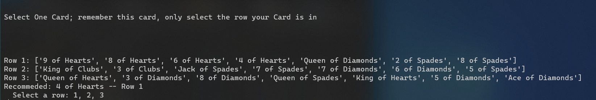
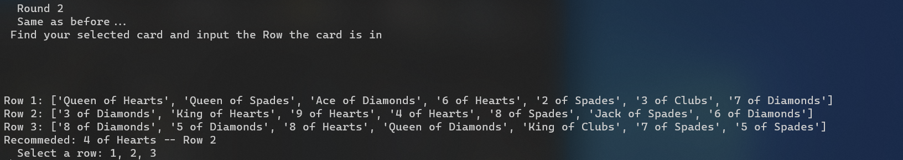
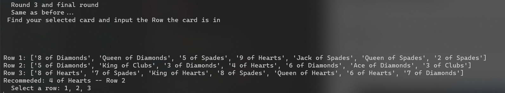

# pyHocusPocus


* usage 
```
Windows 10
py .\Pocus.py
```
## Demo
* Screen Shots
* During Demo Recommended Card was used, but is not required. However the ending will look slightly different since you arent using the card it recommends.




#### Testing
```
comment out line 260 in Pocus.py, person_Pocus()
and uncomment line 261 test_Pocus()
Then run test-pocus.ps1
This will run 1000 tests and verify that all answers are correct.
```
* usage
```
Powershell
.\test-pocus.ps1
CMD
Powershell -ExecutionPolicy Bypass -file .\test-pocus.ps1
```
